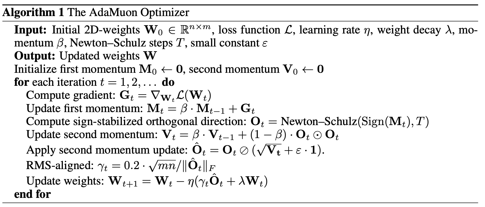
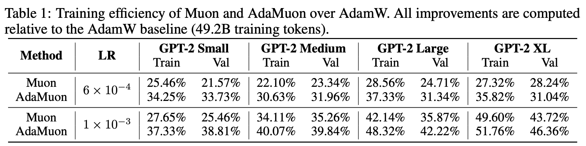
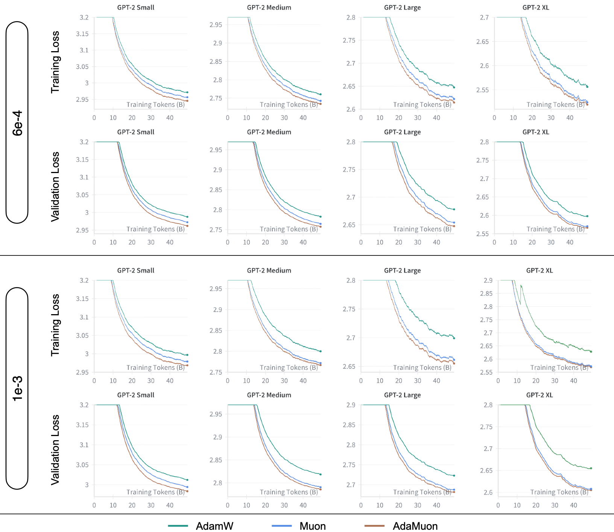
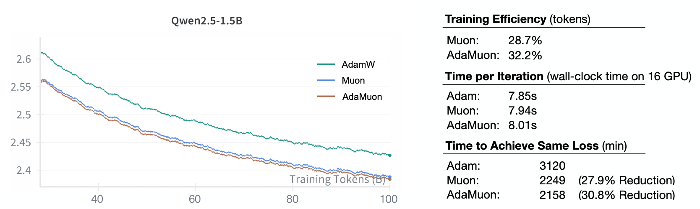
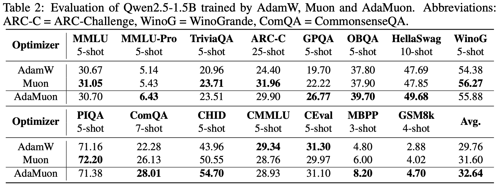

# AdaMuon

This is the official repository for the paper [AdaMuon: Adaptive Muon Optimizer](https://arxiv.org/abs/2507.11005).

## Introduction

AdaMuon is an effective optimizer based on Muon. It can achieve more than 40% training efficiency compared to AdamW.



## Quick Start

This repository contains two projects: one is the GPT-2 experiments, and the other is the open-sourced Megatron-LM code, which we included to facilitate large-scale experiments.

## Performance



<hr>



<hr>



<hr>



## Contact

If you have any questions, suggestions, or feedback, please feel free to contact us at [chongjiesi@sjtu.edu.cn](mailto:chongjiesi@sjtu.edu.cn).

## Citation

If you find this repository useful, please consider giving it a star and citing it in your work:

```bibtex
@article{si2025adamuon,
  title={AdaMuon: Adaptive Muon Optimizer},
  author={Si, Chongjie and Zhang, Debing and Shen, Wei},
  journal={arXiv preprint arXiv:2507.11005},
  year={2025}
}
```
